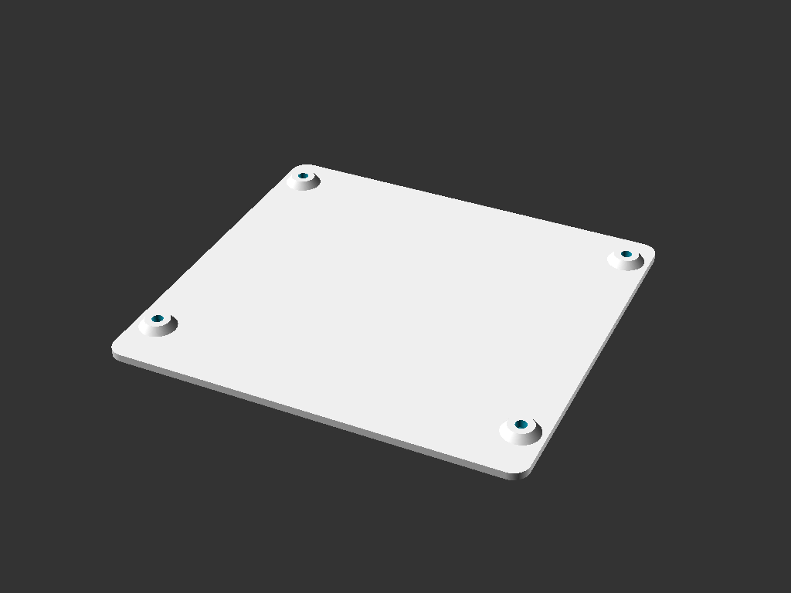

## Enclosure for Peter Bartlett's MISE and M3SE.
http://bartlettlabs.com/MISE/index.html  
http://bartlettlabs.com/M3SE/index.html

Pictures: https://photos.app.goo.gl/1NdcbL9hprvxRTdB7

STL files for 3d-printing are in [releases](../../releases/latest)

### Directions:

#### 1 - print the 3 files
 MISE_M3SE_top_cover_\<version\>.stl  
 MISE_M3SE_bottom_cover_\<version\>.stl  
 MISE_M3SE_small_parts_\<version\>.stl
 
 PLA, 20% infill, 3 walls is fine.

 Or buy a print from [CraftCloud](https://craftcloud3d.com/offer/f326aa39-0bd5-4f7d-a8ab-a3166577bb0f)

#### 2 - Aquire the following parts

* **1 40-pin "IDE" male-female extension cable, 4 inch length**  
 It needs to be an extension, with one male and one female connector.  
 The direction the cable exits the connector on the *male* end matters. The cable should go *away* from the key notch in the side of the connector.  
 No extra fold / strain relief clip on the male connector.  
 No special requirements for the female connector.  
 
 http://www.cablesonline.com/240pinidedir.html  
 Change “Available Lengths: 4 inches FI-004”

* **4 flat-head #6 x 3/4" screws**  
 (These screws are optional: There are printed "nails" included in the small_parts stl which can be used in place of screws)  
 Home Depot:  
 https://www.homedepot.com/p/Everbilt-6-32-x-3-4-in-Phillips-Flat-Head-Stainless-Steel-Machine-Screw-6-Pack-814561/204274823

* **4 small rubber feet**  
 http://www.homedepot.com/p/Everbilt-1-2-in-Self-Adhesive-Vinyl-Surface-Bumpers-16-per-Pack-49967/203661150

#### 3 - Assembly
Unplug the CF reader from the mainboard & remove the CF card(s) from the reader.

Remove the 4 nylon stand-offs from the screw holes on the mainboard.

Plug the male end of the IDE extension cable onto the CF reader.

Lay the CF reader flat in the small tray formed into the corner of the top_cover, with the lights and jumpers up facing you.  
Install the retainer over top of the CF reader. (refer to pics)

Orient the top cover so that the network, vga, & power side is away from you.  
Set the mainboard standing up behind the 2 rear screw posts, network/vga/power side down.  

Connect the free end of the IDE extension cable to the IDE plug on the mainboard.

Lift the mainboard up from behind the 2 rear screw posts, tip forward toward yourself, and lay the mainboard flat atop all 4 screw posts.

Place the bottom cover on top of the mainboard, with the 4 short risers pointing down.

Install the 4 screws.

### Painting
A very close off-the-shelf match to the RCA "Mercedes Silver" TRS-80 paint is
[Dupli-Color Bumper Coating FB108 Medium Silver](http://www.amazon.com/Dupli-Color-FB108-Medium-Flexible-Coating/dp/B00296DXN4).

## Author / License

 This work is licensed under a <a rel="license" href="http://creativecommons.org/licenses/by-sa/4.0/">Creative Commons Attribution-ShareAlike 4.0 International License</a>.  
Brian K. White - b.kenyon.w@gmail.com

Designed with [OpenSCAD](https://www.openscad.org/)
