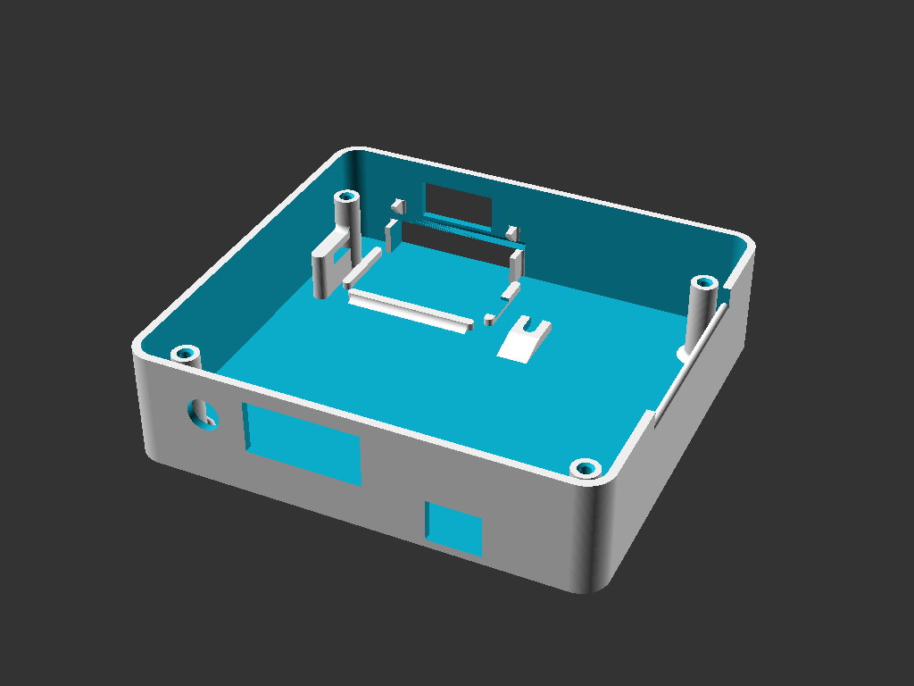

## Enclosure for Peter Bartlett's MISE and M3SE.
http://bartlettlabs.com/MISE/index.html  
http://bartlettlabs.com/M3SE/index.html

The source design file is written in OpenSCAD  
https://www.openscad.org/

There are also FreeCAD files in the FreeCAD directory. These are the original design, but the files are difficult to edit without breaking the model.  
http://www.freecadweb.org/

The *.stl files are for 3d-printing.

Pictures: https://goo.gl/photos/jDpvjbgjePCddrG99  
(scroll to the bottom for the most recent)

### Directions:

#### 1 - 3D print the *.stl files
 top_cover.stl  
 bottom_cover.stl  
 retainer.stl  

#### 2 - Aquire the following parts

* **1 40-pin "IDE" male-female extension cable, 4 inch length**  
 It needs to be an extension, with one male and one female connector.  
 The direction the cable exits the connector on the *male* end matters. The cable should go *away* from the key notch in the side of the connector.  
 No extra fold / strain relief clip on the male connector.  
 No special requirements for the female connector.  
 
 http://www.cablesonline.com/240pinidedir.html  
 Change “Available Lengths: 4 inches FI-004”

* **4 flat-head #6 x 3/4" screws, any type**  
 Home Depot:  
 https://www.homedepot.com/p/Everbilt-6-32-x-3-4-in-Phillips-Flat-Head-Stainless-Steel-Machine-Screw-6-Pack-814561/204274823

* **4 small rubber feet**  
 http://www.homedepot.com/p/Everbilt-1-2-in-Self-Adhesive-Vinyl-Surface-Bumpers-16-per-Pack-49967/203661150

#### 3 - Assembly
Unplug the cf reader from the MISE.  
Remove the 4 nylon stand-offs from the screw holes on the MISE.  
Plug the female end of the 40 pin extension cable into the MISE where the cf reader used to be.

Lay the cf reader flat in the small tray formed into the corner of the top_cover, with the lights and jumpers up facing you. The white CF slot rails on the back side of the cf reader fits exactly into that tray.

Looking down into the top_cover with the cf reader in the top-right corner, insert the offset foot end of the retainer clip into the slot to the right of the cf reader.  
Swing the retainer clip down over the cf reader, and back towards you, enough to slide the left side of the retainer into the slot to the left of the cf reader, attached to the screw post.  
Push the retainer clip forward until it snaps firmly in place.

Turn the top_cover around so the cf reader is to your right and close to you, and the round hole on the rear wall is away from you.  
Hold the MISE upside down with the network jack away from you.  
Angle the network jack down into the rear wall away from you. Rest the rear side of the MISE on the two rear screw posts, keep the front side of the MISE lifted up.  
Connect the male end of the 40 pin extension cable onto the cf reader.  
Lay the front edge of the MISE down, pay attention that the network jack pokes into the square hole in the rear wall as you swing the front edge down.

Press the 4 rubber feet onto the flat side of the base_plate, just inside of the screw holes (right next to each screw hole, towards the center of the plate rather than towards the outside edge).  
Place the base_plate on top of the MISE, with the short risers down, touching the MISE (ie with the new feet up).  
Make sure the screw holes line up. The screws are closer to the rear wall and further away from the front wall.  
The base_plate should now be flush with the edge of the top_cover. 

Install the 4 screws. Don't over-tighten. 3d-printing is not super strong.

DONE!

## Author / License

These files are licenced under the GPL.  
http://www.gnu.org/licenses/gpl-3.0.en.html  
Brian K. White - bw.aljex@gmail.com - 20160423
